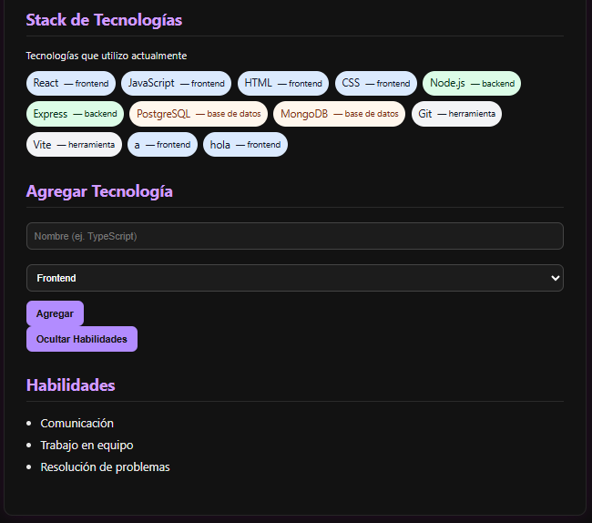

# 📄 Hoja de Vida en React – Fabián Marín

Actividad: GA1-220501096-03-AA1-EV08 – Eventos y estado local en React – CV dinámico con interactividad

## Resumen
Proyecto que extiende un CV en React para manejar eventos y estado local. Permite:
- Mostrar/Ocultar la sección de habilidades.
- Agregar tecnologías dinámicamente al stack desde un formulario controlado.

1. Actividades asociadas

## Ejecutar localmente
1. `npm install`
2. `npm run dev`
3. Abrir `http://localhost:5173`

## Archivos importantes
- `src/data/cvData.js` — datos iniciales
- `src/App.jsx` — estado y funciones principales
- `src/components/FormularioTecnologia.jsx` — formulario controlado
- `src/components/ToggleHabilidades.jsx` — muestra/oculta habilidades

## Commits requeridos
1. chore: organización inicial del proyecto para integración de eventos  
2. feat: creación de componente ToggleHabilidades con renderizado condicional  
3. feat: implementación de useState para mostrar/ocultar habilidades  
4. feat: creación de componente FormularioTecnologia con inputs controlados  
5. feat: función agregarTecnologia en App.jsx y paso como prop  
6. feat: renderizado dinámico de tecnologías desde estado  
7. docs: actualización del README con descripción de eventos y estados

## Autoevaluación (respuestas de ejemplo)

¿Qué ventaja ofrece mantener el estado en App.jsx al manejar datos globales del CV?

- Centraliza los datos (single source of truth) y facilita compartirlos entre hijos sin duplicar estado.

¿Cómo evitaste que el formulario recargara la página?

- Usando e.preventDefault() en el handleSubmit.

¿Qué función cumple setTecnologias([...prev, nueva]) frente a push()?

- push() muta el array original (no recomendable). Con spread creamos un nuevo array para que React detecte el cambio y vuelva a renderizar.

¿Cómo podrías adaptar FormularioTecnologia para otros datos como idiomas o
proyectos?

- Hacer el componente más configurable por props (campos, validaciones, callback onAgregar) para reutilizarlo para idiomas, proyectos, etc.

¿Cómo se vería afectado tu código si manejaras el estado directamente en el componente
hijo?

-El estado queda local y otros componentes no reciben las actualizaciones sin prop-drilling o context. Para datos compartidos es mejor levantar el estado al padre.